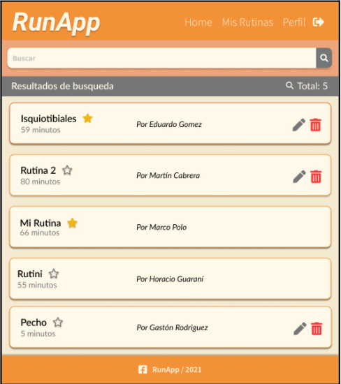
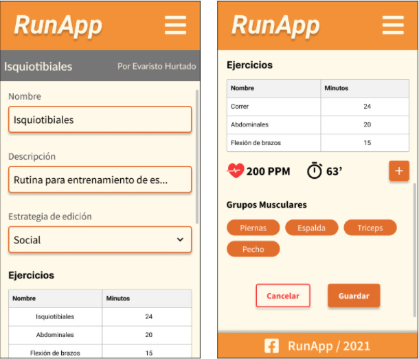

## Algoritmos III - Trabajo práctico 2021

### Entrega 1

### Dominio general

> Como dominio contaremos con una de las implementaciones del trabajo práctico RunApp de la cursada de la materia Algoritmos II del año 2021. Si el grupo está formado por integrantes de diferentes grupos, deben ponerse de acuerdo sobre qué implementación van a trabajar. Para quienes no pertenecían al grupo de la materia anterior, deberán solicitar permiso al tutor para que les brinde acceso al repositorio de algoritmos II. Los grupos son formados como máximo por 3 integrantes.
Para visualizar el assignment haga [Click Aqui](https://classroom.github.com/g/MvS8D0EC)

> Recuerden que el primero en aceptarlo crea el grupo y el resto de los integrantes seleccionan al grupo que se van a sumar. Ante cualquier duda pueden consultar con el equipo de docentes.

### Repositorios

> Trabajaremos como acostumbramos en otras materias con Github. Por lo tanto deberán crear un repositorio para el frontend que vamos a modelar. El proyecto constará con dos ramas (branch) mínimo: **master** y **development**. Trabajarán desarrollando cada entrega en el branch development y para el día de la entrega se realizará un TAG entregaX, dónde X es el nro. de TP (en este caso 1) sumado a un pull request a master. 
Una vez realizada la corrección por parte de los tutores, se crearán tickets informando los cambios solicitados que deberán cerrarse. Al momento de cerrar los mismos, siempre trabajando sobre el branch development, avisan al docente para realizar la revisión correspondiente.
Una vez que queda sin correcciones, el docente aprueba el pull request, mergeando la rama a master. Antes de continuar con el desarrollo de su siguiente entrega, el grupo debe crear un TAG sobre master con la denominación RunApp0.X, donde X es el nro de entrega.

#### Entregables
#### 1. Login
##### 1.1 Versión Web

##### 1.2 Versión Tablet 

##### 1.3 Versión Mobile

#### 2. Main: Búsqueda de Rutinas
A partir de esta pantalla en adelante, aparece un header que se mantiene anclado al margen superior de la vista. El footer, en cambio, queda al pie de la página pudiendo estar visible o no si el largo del contenido lo permite mediante la navegación con la scrollbar.
##### 2.1 Versión Web

##### 2.2 Versión Tablet

##### 2.3 Versión Mobile

#### 3. Rutinas
##### 3.1 Version Web

##### 3.2 Versión Tablet

##### 3.3 Versión Movil

#### 4. Ejercicios
##### 4.1 Version Web

##### 4.2 Version Tablet

##### 4.3 Version Mobile

#### 5. Mis rutinas

##### 5.1 Version Web

##### 5.2 Version Tablet 

##### 5.3 Version Mobile 

#### 6. Perfil de Usuario

##### 6.1 Version Web

##### 6.2 Version Tablet 

##### 6.3 Version Mobile 

## Se Pide
    1. Maquetar en HTML y CSS.
    2. Implementar una paleta de colores (no necesariamente la de las muestras). Debe ser fácil poder modificarla.
    3. Considerar estos tamaños para los dispositivos.
        - **Mobile** un ancho máximo de **400px**.
        - **Tablet**  ancho entre **401px** y **768px**.
        - **Web** a partir de los **769px** de ancho.

## Recomendaciones
    1. Las Fuentes a utilizar puden obtenerlas de (https://fonts.google.com/)
    2. Los Iconos a utilizar puden  obtenerlos de (https://fontawesome.com/)

