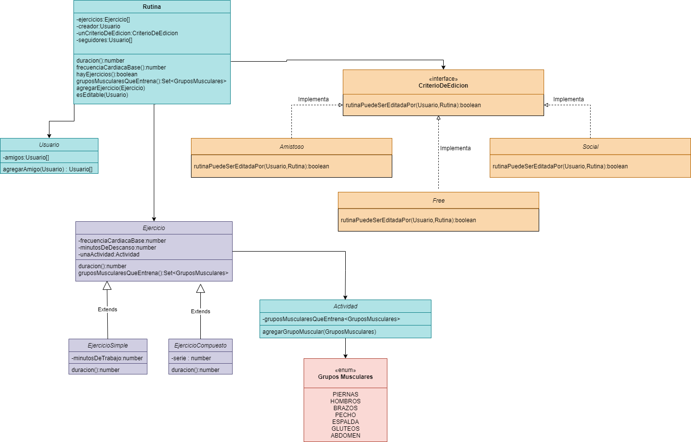

# Entrega 2 : Typescript

- Se desarrolla en el lenguaje Typescript parte del dominio del modelo de negocio.

    1. Se modela la clase ejercicios con su cálculo de tiempo, la clase rutina pudiendo calcular su tiempo total de duración, las Frecuencia Cardíaca Base y sus grupos musculares asociados.
    2. Si una persona puede editar una rutina en base a su estrategia (Solamente modelaremos las estrategias amistoso, social y free).
    3. Se desarrolla testeo unitario

## Diagrama de Clases

### Integrantes
- Joaquin Arnedo
- Rodrigo Nieto
- Stephanie Pazos
